# Детальный анализ задачи автоматизации ElsaBridgeQuestTask

## Назначение

Задача `ElsaBridgeQuestTask` автоматизирует выполнение квеста "Bridge Builder" на платформе Elsa. Цель - выполнить бридж ETH на сумму ~$20-21 из сетей Arbitrum или Optimism в сеть Base.

## Ключевые константы и параметры

### Сети

-   **Отправляющие сети:** Arbitrum, Optimism
-   **Целевая сеть:** Base
-   **Множитель расходов:** 1.005 (0.5% на комиссии)

### Суммы

-   **Минимальная сумма бриджа:** $20.5 USD
-   **Максимальная сумма бриджа:** $21 USD
-   **С учетом расходов:** $20.6 - $21.1 USD
-   **Минимальная сумма пополнения:** $20.7 USD (с учетом двойных расходов)

## Алгоритм выполнения

### 1. Проверка статуса квеста

-   Получение списка квестов с дашборда
-   Поиск квеста "Bridge Builder"
-   Если квест уже выполнен - завершение

### 2. Анализ балансов

-   Получение балансов ETH во всех сетях
-   Проверка достаточности средств в отправляющих сетях

### 3. Логика принятия решений

#### Сценарий A: Прямой бридж

-   Если в Arbitrum или Optimism достаточно ETH (≥$20.6)
-   Выполняется бридж случайной суммы $20.6-$21.1 в Base

#### Сценарий B: Пополнение + бридж

-   Если в отправляющих сетях недостаточно средств
-   Проверяется баланс в Base
-   Если в Base достаточно средств (≥$20.7):
    -   Случайно выбирается сеть для пополнения (Arbitrum или Optimism)
    -   Выполняется бридж из Base в выбранную сеть на $20.7-$21.1
    -   После пополнения выполняется бридж обратно в Base на $20.6-$21.1

### 4. Обработка ошибок

-   Если недостаточно средств нигде - выбрасывается ошибка `StopExecutionException` с уведомлением

## Диаграмма логики выполнения

```mermaid
flowchart TD
    A[Начало выполнения задачи] --> B[Получение квестов с дашборда]
    B --> C{Квест Bridge Builder найден?}
    C -->|Нет| D[Ошибка: квест не найден]
    C -->|Да| E{Квест уже выполнен?}
    E -->|Да| F[Завершение - квест выполнен]
    E -->|Нет| G[Получение балансов кошелька]

    G --> H[Анализ балансов ETH в сетях]
    H --> I{Есть ли достаточный баланс в Arbitrum или Optimism? >=$20.6 USD}

    I -->|Да| J[Сценарий A: Прямой бридж]
    I -->|Нет| K[Проверка баланса в Base]

    J --> L[Выбор случайной суммы $20.6-$21.1 USD]
    L --> M[Выполнение бриджа Arbitrum/Optimism → Base]
    M --> N[Завершение]

    K --> O{Достаточно ли средств в Base? >=$20.7 USD}
    O -->|Нет| P[Ошибка: недостаточно средств StopExecutionException]
    O -->|Да| Q[Сценарий B: Пополнение + бридж]

    Q --> R[Случайный выбор сети Arbitrum или Optimism]
    R --> S[Расчет суммы пополнения $20.7-$21.1 USD]
    S --> T[Бридж Base → выбранная сеть]
    T --> U[Получение новых балансов]
    U --> V[Расчет суммы для целевого бриджа $20.6-$21.1 USD]
    V --> W[Бридж выбранная сеть → Base]
    W --> N

    style A fill:#3d039c
    style F fill:#1a371b
    style N fill:#1c3e1d
    style D fill:#71000c
    style P fill:#530009
    style J fill:#5e3a00
    style Q fill:#4f3100
```

### Особенности:

-   **Случайные суммы** в заданных диапазонах
-   **Округление** до 2 знаков после запятой
-   **Генерация естественных сообщений** для чата
-   **Поллинг статуса транзакций** в реальном времени
-   **Автоматическая подпись и отправка транзакций** через Web3

## Детали констант

### Сети

-   **SENDER_BRIDGE_CHAINS:** ["arbitrum", "optimism"]
-   **TARGET_BRIDGE_CHAIN:** "base"

### Суммы (USD)

-   **MIN_TARGET_BRIDGE_AMOUNT_USD:** 20.5
-   **MAX_TARGET_BRIDGE_AMOUNT_USD:** 21.0
-   **EXPENSES_MULTIPLIER:** 1.005 (0.5% комиссии)
-   **MIN_TARGET_BRIDGE_AMOUNT_USD_WITH_EXPENSES:** 20.6
-   **MAX_TARGET_BRIDGE_AMOUNT_USD_WITH_EXPENSES:** 21.1
-   **MIN_TOP_UP_AMOUNT_USD_WITH_EXPENSES:** 20.7

### Логика расчета сумм

1. **Прямой бридж:** $20.6 - $21.1 (с учетом комиссий)
2. **Пополнение:** $20.7 - $21.1 (с учетом двойных комиссий)
3. **Целевой бридж после пополнения:** $20.6 - $21.1
